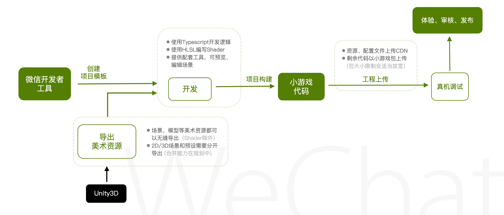

# 资源导出方案

## 方案概览

这个模块是整个 Adaptor 导出方案的基础，资源导出方案适用于满足下列条件的游戏：

* Unity 工程不是以 C# 代码为主的工程，没法使用完整导出方案；
* 想用Typescript做开发，而不想用Javascript做二次开发；
* 评估下来完整导出方案对原有工程改过过大的游戏，或根据产品计划本来就要做重大改版的游戏；

对于采用资源导出方案的游戏，整个工作流如下：

## 运行机制

首先通过导出插件，可以将Unity以GameObject-MonoBehavior形式组织的节点树导出成`微信小游戏性能优化方案`的节点树（以场景或prefab预制体的形式），也可以单独导出某个资源（纹理、动作控制器等）

导出后会形成微信方案的资源包格式`.mgepackage`，然后将其拖入微信方案的开发者工具，即可像unity的unitypackage解包机制一样导入微信方案内。

## 快速入门

上述方案具体的工作流可以参考 [quickstart](./quickstart.md)。

## 常见问题

1. shader 导出的注意事项
UnityShader 在微信方案里的对应概念叫 effect，虽然渲染程序都基于HLSL，但是因为渲染管线不同，无法实现自动化的转化。因此这部分的导出可以参见[材质转化](../plugin/material/index.md)，通过改造你的项目或是扩展导出逻辑完成。

2. UI导出的注意事项
`微信小游戏性能优化方案`出于性能等考虑，2D世界和3D世界是完全分离的。因此如果你的Unity游戏采用了基于`NGUI`、`UGUI`等UI方案，需要考虑将UI部分全部独立成prefab，并使用[NGUI导出模块](../plugin/ngui-tree.md)导出到微信方案

3. 配置、音频等有什么好的迁移手段吗
`微信小游戏性能优化方案`针对微信小游戏的场景，有一个精心设计过的资源加载体系，配置或音频文件等的导出需要一点点特殊处理才能进入该体系。请参见[原始资源导出与使用](../plugin/raw.md)
